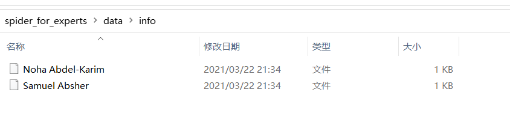
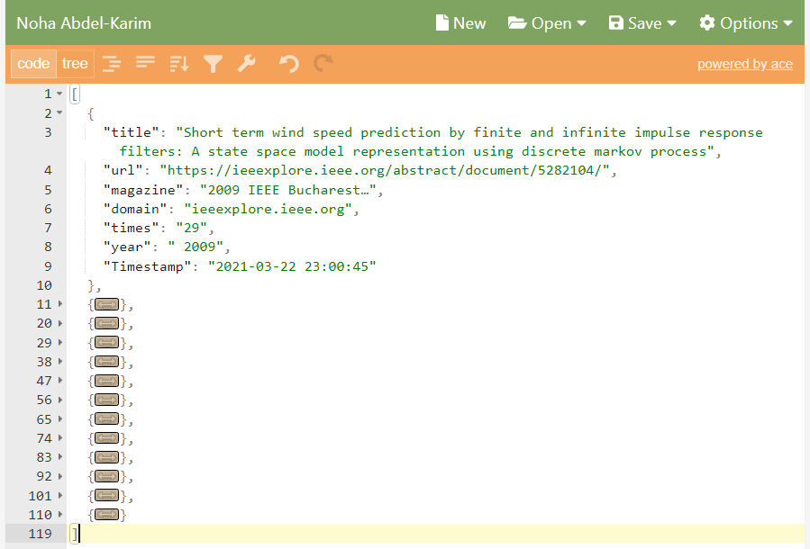

# spider_for_experts

---
# content
* 爬虫部分
* 如何使用数据
* requirements
---

## 爬虫部分

爬虫部分由两部分构成：

1. 从[兰德公司官网](https://www.rand.org/about/people.html "专家列表界面")的专家列表爬取专家的名字；
2. 在[谷歌学术](https://scholar.google.com/)利用高级搜索，搜索包含专家名字的论文，过滤并保存。

爬取谷歌学术的代码文件主要有三个：`g_utils.py`、`google_scholar.py`、`utils.py`

爬取兰德公司官网的专家列表的代码文件有：`for_rand.py`

###  for_rand.py

输入命令`python3 for_rand.py`即可获取兰德公司的所有专家名字及研究方向，

结果保存在`./data/stafflist.json`文件中

本来以为兰德公司的专家页面和普通爬虫的流程一样直接对获取到的html进行解析即可，然而实际工作时发现它采用了异步传输数据的方式，

真实的专家信息实际上在[这个页面](https://www.rand.org/content/rand/about/people/_jcr_content/par/stafflist.xml)中，因此直接获取保存即可。

获取到的xml数据有很多内容，由于我只关心专家名字及其研究方向，因此将这两部分内容单独提取出来。

原始数据见文件`./data/stafflist.xml`

### google_scholar.py

爬取谷歌学术搜索结果的主函数部分。在运行其之前，请先运行`for_rand.py`以获取专家列表。

在命令行输入命令：`python3 g_utils.py`

爬虫会先查找文件`./data/stafflist.json`并获取专家名字列表，

随后依次在谷歌学术上对这些专家进行搜索，以得到**不含引用**的论文信息。

爬取结果将被保存在以专家的名字命名的文件中，文件内容为与该专家相关的所有关注的检索信息。

**所有的结果将被保存在`./data/info/`目录下**，如下图所示（若下图无法显示，请查看文件`./example/info_list.png`）

爬取到的专家的相关信息的示例见文件`./example/Samuel Absher`，其结构如下图所示：

若下图无法显示，则可在[此页面](http://jsoneditoronline.org/index.html)并上传文件`./example/Samuel Absher`查看json结构。

这是Noha Abdel-Karim的相关信息，文件名是`Noha Abdel-Karim`，虽然没有后缀名，但这其实是一个json文件。json内容是一个由13个字典构成的列表，字典的键值对如图所示。

**爬取时若遇到意外情况导致程序退出（如被谷歌封了IP），切换主机的VPN站点并重新运行`google_scholar.py`即可，爬虫可在中断处继续开始工作，而不是从头开始。**

#### Attention！！！

这里采用了以专家名命名文件、信息作为文件内容的方式，一方面是为了防止数据全都存储在内容中导致内存爆炸；另一方面也是为了爬虫出现异常情况时至少能有一部分数据被保留下来，且当爬虫重新开始工作时，可忽略已保存的数据，从中断处继续工作。

### g_utils.py

爬虫的辅助部分，主要用于请求头的构建、cookie的构建、访问网页、保存指定的html块的内容。

### utils.py

一些通用的工具函数，如json格式的保存及读取等。

## 如何使用数据？

`kits.py`将会告诉你如何使用爬取到的数据。

这个文件中包含了一些函数，通过观察（调用）这些函数可以明白如何使用`for_rand.py`以及`google_scholar.py`爬下来的数据。

函数`get_experts()`以及`get_info()`分别实现了从文件`./data/stafflist.json`和目录`./data/info/`查询信息。

**函数`usage_example`作为一个实例，指明了如何单独使用上述两个函数和如何组合使用上述两个函数来查询信息。**

## requirements

### interpreter version

python 3.8

### packages

bs4

json

os

random

re

requests

time

xml.dom.minidom

xml.etree.ElementTree

