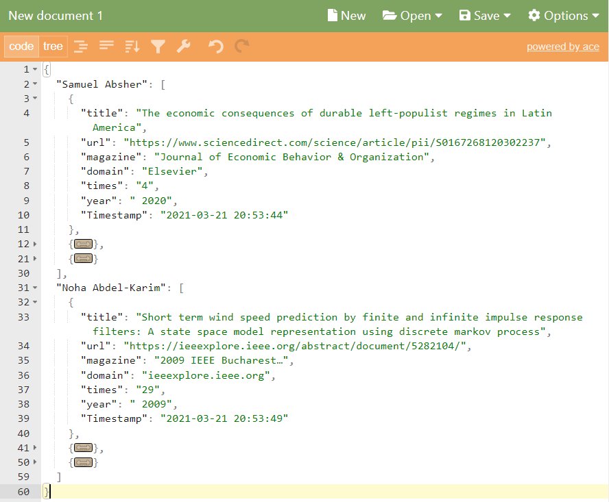

# spider_for_experts

---
# content
* 爬虫部分
* requirements
---

## 爬虫部分

爬虫部分由两部分构成：

1. 从[兰德公司官网](https://www.rand.org/about/people.html "专家列表界面")的专家列表爬取专家的名字
2. 在[谷歌学术](https://scholar.google.com/)利用高级搜索，搜索包含专家名字的论文，过滤并保存。

爬取谷歌学术的代码文件主要有三个：`g_utils.py`、`google_scholar.py`、`utils.py`

### google_scholar.py

爬取谷歌学术搜索结果的主函数部分，在命令行输入命令：

`python3 g_utils.py`

即可爬取

结果保存在当前目录下的文件`papers.json`中

爬取结果的示例见文件`./example/example.json`

若下图无法显示，则可在[此页面](http://jsoneditoronline.org/index.html)查看保存的json结构

### g_utils.py

爬虫的辅助部分，主要用于请求头的构建、cookie的构建以及爬虫的具体实现

### utils.py

一些通用的工具函数，如json格式的保存及读取等。

## requirements

### interpreter version

python 3.8

### packages

bs4

json

random

re

requests

time

