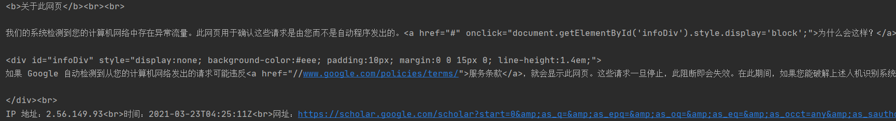

##  目前存在的问题

**4.05更：**

**问题2可能是代理不稳定导致的，没有好的解决办法，暂时通过增加重连次数来削减代理不稳定造成的影响。**

 **问题3应该也是代理不稳定造成的，看描述应该是数据流在接收的过程中出错了。当时未明确记录问题出在哪里，等以后再出现了再改。**

程序目前只能获取搜索结果小于100条的专家及其内容，若搜索结果过大，则会产生如下问题：

1. 会被谷歌检测到，并返回一个空页，返回页html节选如下图所示：

  此时谷歌会返回一个正常的html页面而非抛出一个异常，程序接收到的状态码仍为200，但并没有内容。

2. 频繁报如下错误：

`HTTPSConnectionPool(host='scholar.google.com', port=443): Max retries exceeded with url: /scholar?start=30&as_q=&as_epq=&as_oq=&as_eq=&as_occt=any&as_sauthors=+Mark+V.+Arena&as_publication=&as_ylo=&as_yhi=&hl=zh-CN&as_sdt=0%2C5&as_vis=1 (Caused by SSLError(SSLEOFError(8, 'EOF occurred in violation of protocol (_ssl.c:1124)')))`

3. 2021/03/04 19:12:42新增报错信息如下所示：

   `('Connection broken: IncompleteRead(8166 bytes read, 2074 more expected)', IncompleteRead(8166 bytes read, 2074 more expected))`

   请求的网址为：`https://scholar.google.com/scholar?start=20&as_q=&as_epq=&as_oq=&as_eq=&as_occt=any&as_sauthors=+Gabriela+Alvarado&as_publication=&as_ylo=&as_yhi=&hl=zh-CN&as_sdt=0%2C5&as_vis=1`

   目前仅出现一次，应为偶发现象，留待记录

##  问题原因及解决措施

###  问题1（暂解决，未完美解决）

####  原因

问题1的成因是因为谷歌认为我的请求来自一个爬虫，因此返回一个验证界面而不是搜索结果页面。

####  解决措施

由于**程序中并没有增加对验证界面的破解，因此程序仍然会将其保存到本地，只不过保存的信息长度为0**。因此，在程序中对其添加检测：若连续3个专家的保存信息长度均为0，则抛出提示并退出运行。

此时需要用户手动在浏览器中搜索最新保存的3个文件所对应的专家，**若其谷歌学术的搜索结果确实为空，则重新运行程序即可，程序会从中断处继续运行；若搜索结果不为空，则需删除这3个文件、更换VPN站点、重新运行程序，程序会从这3个专家开始进行爬取。**

### 问题2（暂解决，未完美解决）

####  原因及解决措施

我在网络上搜索了问题2抛出的异常，[这个网页](https://www.pythonheidong.com/blog/article/609527/28b59495099c3e30f4a4/)有较为全面的介绍。其中有关`_ssl.c:1124`的错误的原因及解决措施如下所述：

1. **http连接太多没有关闭导致的**。

​      **解决方法：设置重连次数，发送请求前，关闭多余连接。（失败）**

​      然而，我的程序中设定的请求是`'Connection': 'close'`，并没有多余链接。且程序不需要建立会话，也没必要设置过多重连次数。

2. **访问次数频繁，被禁止访问**

   **解决方法：使用代理（未采用）**

   由于我要访问的是国外的网站，已经在本机使用过一次代理做翻墙操作，且没用其他的国外IP池，因此该方法暂未尝试。

   如果是要降低访问次数的话，程序中已经添加了大量的等待时间，仍然会报该错误。

3. **使用了本地代理（失败）**

   [该网页](https://blog.csdn.net/qq_29176323/article/details/112844648)认为，该错误是由用户本地起的代理软件引起的，建议的解决措施是**关掉本地的代理软件**。

   然而关掉代理软件则无法翻墙访问谷歌学术，因此该方法失败。

4. 也有的网页认为SSL错误可能是由证书引起的，如[该网页](https://www.jianshu.com/p/8deb13738d2c)，它提出了一些针对证书的调整方法，如将verify设为False不验证certificate、 更新系统的certificate、安装requests的security extras等，经测试，均**失败**。

   ### 

